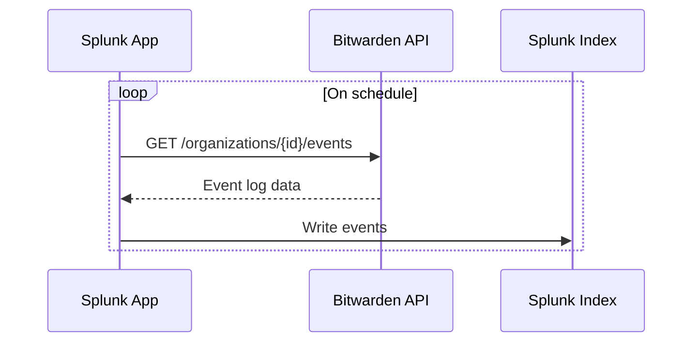
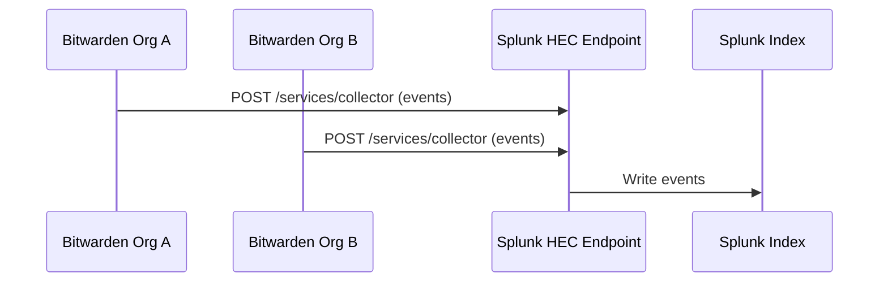

# Event Logs: Single vs. Multiple Organization Support

The Bitwarden Splunk application supports ingesting event logs from one to many different Bitwarden Organizations. However, the set up required for ingestion of event logs for multiple Organizations at a time differs from the set up for a single Organization.

Older versions of the Bitwarden Splunk application only support a polling model for ingesting event data into Splunk. With this model, the Bitwarden Splunk application repeatedly calls the Bitwarden API on behalf of an Organization, and retrieves the Organization's event logs to place into a Splunk index. The Bitwarden Splunk application only supports saving a single configuration for polling based event log retrieval.

This model differs from the new and preferred push based model, where the Bitwarden platform is configured to send event logs for one to many Organizations into Splunk automatically. Splunk exposes a HTTP Event Collector (HEC) endpoint, which allows the Bitwarden platform to send logs for 1-many different Organizations all to the same place.

The differences between the poll and push models are shown below in the diagrams.

### Poll Model

> The Splunk app initiates all requests. Only one Organization configuration is supported at a time.

### Push Model

> The Bitwarden platform initiates all requests. Multiple Organizations can share the same HEC endpoint and token.

## Single Organization Support

If the Splunk Admin only needs to set up event log ingestion for a single Bitwarden Organization, they may use either ingestion model (poll based or push based). Using the push based model is still encouraged, as it will receive long term support and the polling model will not.

## Multiple Organization Support

If the Splunk Admin needs event logs ingested for multiple Bitwarden Organizations, they will be required to use the push based model. This is due to the polling model being restricted to saving a single Organization configuration at a time, and also the native support for pushing events from multiple sources to the same HEC endpoint.

Once the Admin has completed the configuration and has a valid HEC endpoint and token for use, they will set up the event logs integration in the Bitwarden Admin Console for as many Organizations as they need. Each Organization will require its own setup in the Admin Console, but they may share the same HEC endpoint and token.
