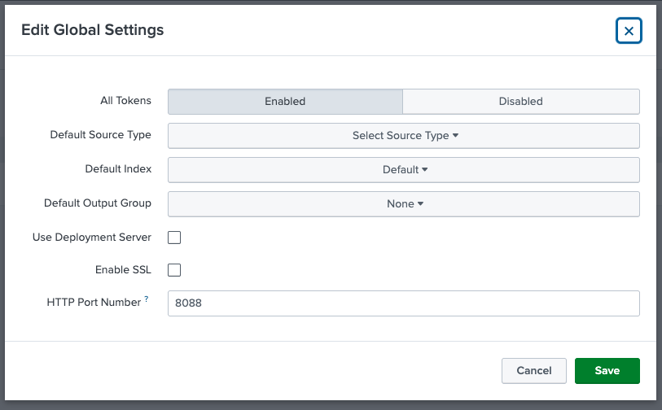
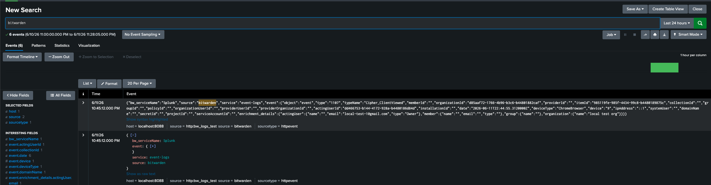

# Test Bitwarden event delivery using HTTP Event Collector (HEC) locally

To test receiving Bitwarden event data in Splunk using HEC, follow this guide.

## Prerequisites

- A Bitwarden test Organization to use for generating events.
- A Bitwarden client running locally, with the `"event-management-for-splunk"` feature flag enabled.
- A Bitwarden server instance running locally, properly configured to push events. Follow the [guide](https://contributing.bitwarden.com/getting-started/server/events) in BW contributing docs if necessary.
    - Note: you will minimally need to run the Api, Identity, Events, and EventsProcessor applications.
- A Splunk instance running locally with Docker. Follow the [guide](https://contributing.bitwarden.com/getting-started/business/splunk-app) in BW contributing docs if necessary.

## 1. Disable SSRF protections in the EventsProcessor application

These protections prevent the EventsProcessor from making requests to localhost, which is a requirement to deliver the event data into the local instance of Splunk. They must be temporarily deleted or commented out.

The code to be removed specifically is all references of `.AddSsrfProtection()` in the `EventIntegrationsServiceCollectionExtensions.cs` file. Restart the application after you've removed it, and continue to the next step.

## 2. Enable HEC in Splunk web

Follow the Splunk [documentation](https://help.splunk.com/en/splunk-enterprise/get-started/get-data-in/9.2/get-data-with-http-event-collector/set-up-and-use-http-event-collector-in-splunk-web#ariaid-title5) to enable HEC on your instance, and create a token for authenticating requests. Ensure that the "Enable SSL" checkbox is unchecked, since we're sending requests across http.

Once you have enabled HEC and received a token, proceed to the next step.

## 3. Enable the Splunk integration in BW Admin Console

In Bitwarden, navigate into Admin Console > Integrations > Event Management. You will see an option for Splunk. To configure, enter the following:

- HTTP Event Collector URL: `http://localhost:8088/services/collector/raw`
- HTTP Event Collector Token: `<TOKEN_VALUE_FROM_STEP_2>`

Save your configuration, and move to the next step.

## 4. Generate events and verify in Splunk web

Perform some actions in the Bitwarden app that generate events. The simplest is viewing a vault item, others include editing or deleting items, etc.

Navigate back into Splunk web and perform a search for Bitwarden logs. A simple search for "bitwarden" should work. When logs are retrieved, you have successfully setup and received event data using HEC!

